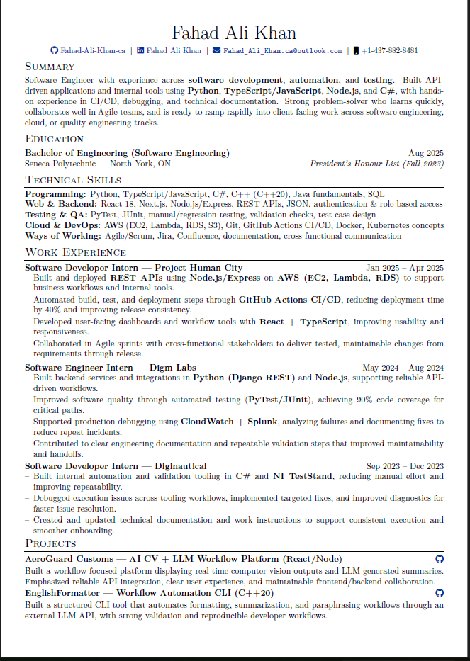

# Clean LaTeX Resume Template

A minimal, single-page resume template built with **LuaLaTeX**, with an automated **resume tailoring CLI** that customizes your resume for any job description using ATS keyword optimization and LLM-powered rewriting.



## Features

- Clean single-column layout with strong visual hierarchy
- Font Awesome 5 icons for contact links (GitHub, LinkedIn, email, phone)
- Custom `joblong` environment for consistent work experience entries
- Hyperlinked contacts and project references
- Compact spacing — fits dense content on one page without feeling cramped
- Built for **LuaLaTeX** with `fontspec` for modern font support
- **Automated resume tailoring** — CLI tool that rewrites your resume to match any job description

## Setup

This template requires **LuaLaTeX** (not pdfLaTeX). LuaLaTeX ships with every major LaTeX distribution — you just need to install one.

### Windows

1. Download and install [MiKTeX](https://miktex.org/download) (recommended) or [TeX Live](https://www.tug.org/texlive/acquire-netinstall.html)
2. During MiKTeX setup, select **"Install missing packages on the fly: Yes"** — this auto-downloads any packages you don't have
3. Open a terminal and verify the install:
   ```bash
   lualatex --version
   ```

### macOS

1. Download and install [MacTeX](https://www.tug.org/mactex/) (full TeX Live distribution for Mac, ~4 GB)
2. Verify the install:
   ```bash
   lualatex --version
   ```

Alternatively, install a smaller footprint with Homebrew:
```bash
brew install --cask basictex
sudo tlmgr update --self
sudo tlmgr install fontspec fontawesome5 enumitem supertabular titlesec parskip collection-fontsrecommended
```

### Linux (Ubuntu/Debian)

```bash
sudo apt update
sudo apt install texlive-full
```

For a lighter install (~500 MB instead of ~5 GB):
```bash
sudo apt install texlive-base texlive-luatex texlive-latex-extra texlive-fonts-extra texlive-latex-recommended
```

Verify:
```bash
lualatex --version
```

### Overleaf (no install needed)

1. Download or clone this repo
2. Upload all files to a new Overleaf project
3. Go to **Menu → Compiler** and select **LuaLaTeX**
4. Hit Compile

---

## Building the PDF

Once LuaLaTeX is installed, compile from your terminal:

```bash
lualatex resume.tex
```

Or use any LaTeX editor with the compiler set to **LuaLaTeX**:

| Editor | How to set compiler |
|---|---|
| [TeXstudio](https://www.texstudio.org/) | Options → Build → Default Compiler → LuaLaTeX |
| [VS Code](https://code.visualstudio.com/) + [LaTeX Workshop](https://marketplace.visualstudio.com/items?itemName=James-Yu.latex-workshop) | Add `"latex-workshop.latex.tools"` config with `lualatex` (see extension docs) |
| [Overleaf](https://www.overleaf.com/) | Menu → Compiler → LuaLaTeX |

### Troubleshooting

**`fontawesome5.sty not found`** — You're missing the Font Awesome package. Install it:
```bash
# MiKTeX (auto-installs, but if needed):
mpm --install fontawesome5

# TeX Live / MacTeX:
sudo tlmgr install fontawesome5
```

**`fontspec` errors** — You're probably compiling with `pdflatex` instead of `lualatex`. Make sure your editor or command uses `lualatex`.

**Missing fonts on Linux** — Install recommended fonts:
```bash
sudo apt install fonts-lmodern
sudo tlmgr install collection-fontsrecommended
```

## Customization

### Sections

The template uses standard `\section*{}` commands. Add, remove, or reorder sections as needed.

### Work Experience

Use the `joblong` environment for each role:

```latex
\begin{joblong}{Job Title — Company Name}{Start -- End}
\item Accomplished X by doing Y, resulting in Z.
\item Another bullet point here.
\end{joblong}
```

### Projects

Projects use a simple `tabularx` layout with an optional GitHub link icon:

```latex
\begin{tabularx}{\linewidth}{@{}l r@{}}
\textbf{Project Name — Short Description (Tech Stack)} & \hfill \href{https://github.com/you/repo}{\faGithub} \\[2pt]
\multicolumn{2}{@{}X@{}}{One or two sentences describing what you built and why it matters.}\\
\end{tabularx}
```

### Contact Icons

Swap or add icons from the [Font Awesome 5 package](https://ctan.org/pkg/fontawesome5):

```latex
\href{https://yoursite.com}{\faGlobe\ yoursite.com}
```

## Resume Tailor CLI

A Python CLI tool that automatically tailors your resume to match a specific job description.

### What it does

1. **Parses your resume** — extracts sections, bullets, and skills from the `.tex` file
2. **Analyzes the job description** — extracts keywords from text, a file, or a URL
3. **Identifies keyword gaps** — compares JD keywords against your resume
4. **Rewrites with LLM** — uses Claude or GPT to rewrite your summary, bullets, and project descriptions to align with the JD (while preserving truthfulness)
5. **Optimizes skills** — reorders skill categories and injects missing keywords
6. **Compiles PDF** — runs `lualatex` to produce the final tailored resume

### Quick start

```bash
# Install dependencies
pip install -r requirements.txt

# Copy and configure your API key
cp .env.example .env
# Edit .env with your LLM_API_KEY

# Keyword gap analysis only (no API key needed)
python -m resume_tailor --jd-text "We need a Python developer with AWS experience..." --keywords-only -v

# Full tailoring from a text file
python -m resume_tailor --jd-file job_description.txt

# Full tailoring from a URL
python -m resume_tailor --jd-url https://example.com/job-posting

# Output .tex only (skip PDF compilation)
python -m resume_tailor --jd-file job.txt --no-compile
```

### CLI options

| Flag | Description |
|---|---|
| `--jd-text` | Job description as direct text |
| `--jd-file` | Path to a `.txt` file with the job description |
| `--jd-url` | URL of the job posting (scraped automatically) |
| `--resume` | Path to `.tex` file (auto-detected if only one exists) |
| `--output-dir` | Output directory (default: `output/`) |
| `--no-compile` | Skip `lualatex` PDF compilation |
| `--keywords-only` | Only run keyword gap analysis, no LLM rewriting |
| `--provider` | LLM provider: `anthropic` or `openai` |
| `--model` | LLM model name (e.g. `claude-sonnet-4-20250514`, `gpt-4o`) |
| `-v, --verbose` | Show detailed keyword analysis |

### Configuration

Create a `.env` file (see `.env.example`):

```env
LLM_PROVIDER=anthropic
LLM_API_KEY=your-api-key-here
LLM_MODEL=claude-sonnet-4-20250514
LUALATEX_CMD=lualatex
```

---

## File Structure

```
.
├── FahadAliKhan_Resume.tex   # Main resume template — edit this
├── FahadAliKhan_Resume.pdf   # Compiled preview
├── preview.png               # Screenshot for the README
├── resume_tailor/             # Automated tailoring CLI tool
│   ├── cli.py                # CLI entry point
│   ├── models.py             # Data models
│   ├── latex_parser.py       # .tex → structured data
│   ├── latex_generator.py    # Structured data → .tex
│   ├── job_parser.py         # JD parsing (text/file/URL)
│   ├── keyword_analyzer.py   # ATS keyword gap analysis
│   ├── llm_client.py         # Provider-agnostic LLM wrapper
│   ├── rewriter.py           # LLM-powered rewriting
│   └── compiler.py           # lualatex PDF compilation
├── requirements.txt           # Python dependencies
├── setup.py                   # Package setup
├── .env.example               # Environment variable template
├── .gitignore
├── LICENSE
└── README.md
```

## License

This template is released under the [MIT License](LICENSE). Use it, fork it, make it yours.

## Contributing

Found a bug or have an improvement? PRs and issues are welcome.